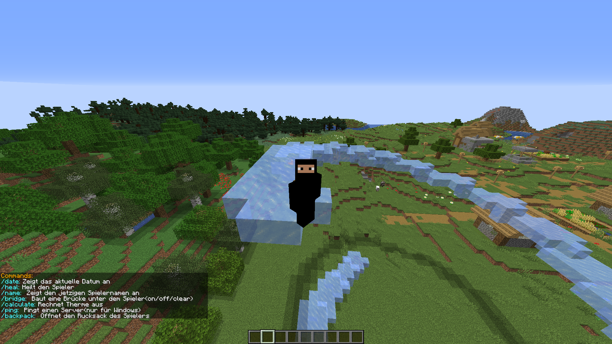

# Minecraft Plugin

Mein erstes Minecraft Plugin mit ein paar Commands. Die Commands sind wie folgt:

| Befehl     | Beschreibung                        | Weitere Parameter  |
|------------|-------------------------------------|--------------------|
| /date      | Zeigt das aktuelle Datum an         |                    |
| /heal      | Heilt den Spieler                   |                    |
| /name      | Zeigt den jetzigen Spielernamen an  |                    |
| /bridge    | Baut eine Brücke unter dem Spieler  | on/off/clear       |
| /calculate | Rechnet Therme aus                  | Therm (Bsp.: 15+3) |
| /ping      | Pingt einen Server(nur für Windows) |                    |
| /backpack  | Öffnet den Rucksack des Spielers    |                    |

Außerdem begrüßt das Plugin jeden Spieler und verteilt/managed Rollen(OP/Player).

